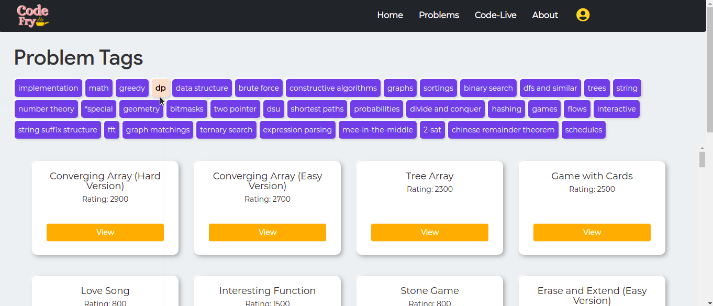
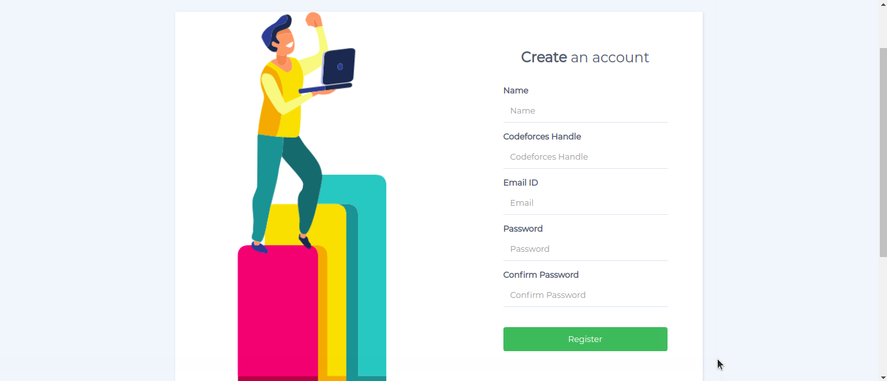
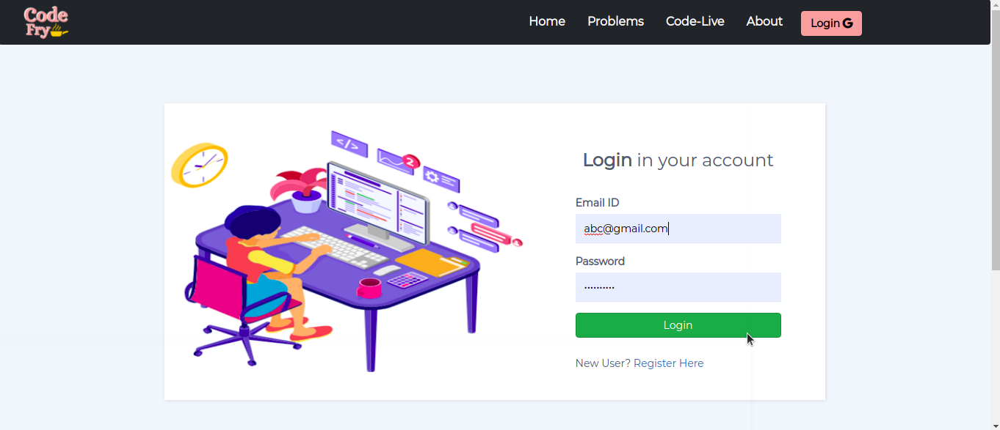
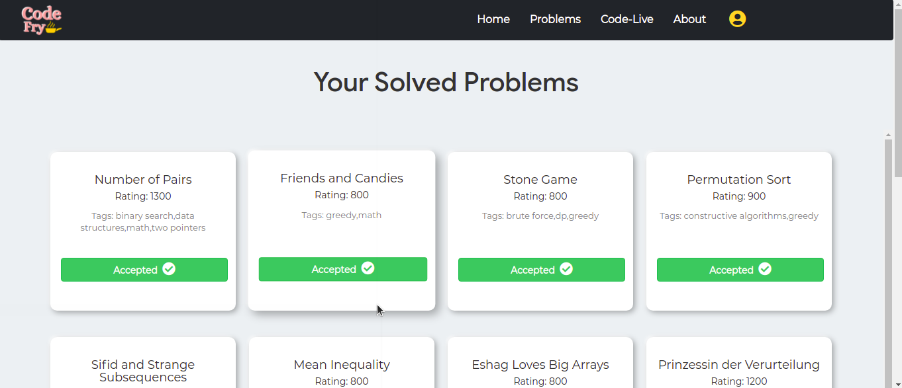
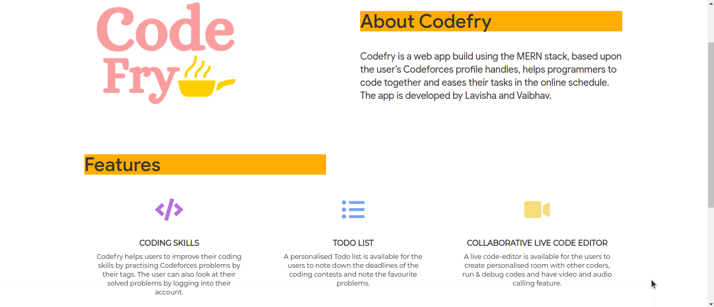
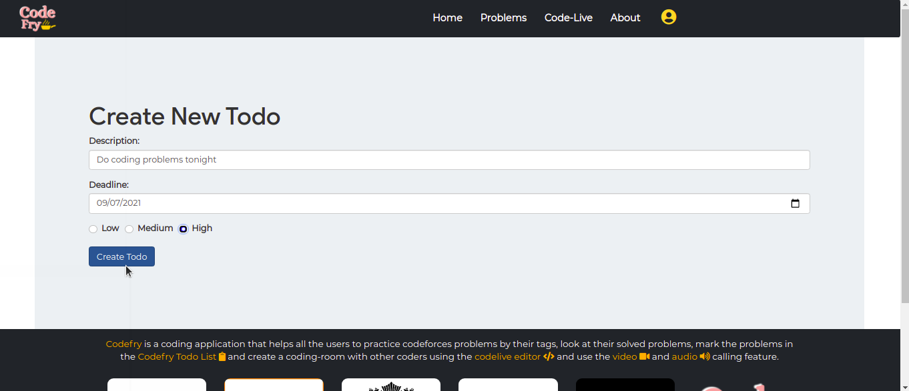
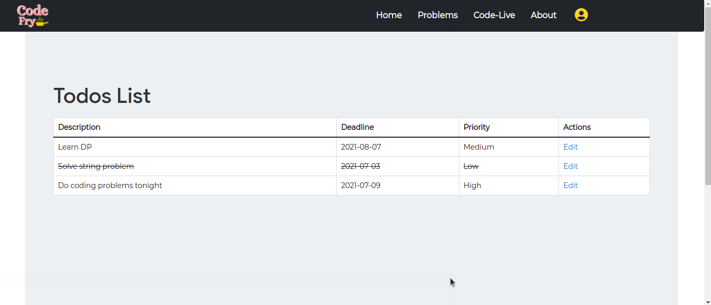
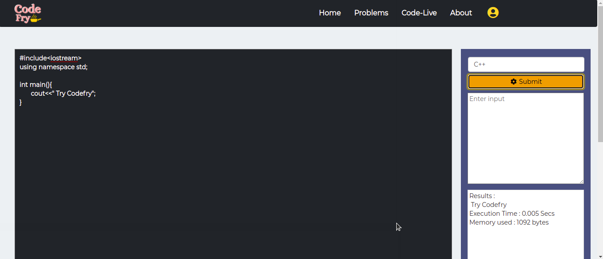

# CodeFry
Codefry is a MernStack Web Application, based upon the user’s Codeforces profile handles, helps programmers to code together and eases their tasks in the online schedule.

## Setup (APIs used)
Following APIs are required to run this web app:

- [Codeforces Problem Set API](https://codeforces.com/api/problemset.problems?tags=implementation)
- [Codeforces User Status API](https://codeforces.com/api/user.status?handle=Fefer_Ivan&from=1&count=10)
- [Rapid Judge API](https://judge0-ce.p.rapidapi.com/submissions)

## Instructions

#### Environment Variables
- Place the API keys in `.env` with your own

## How to run?
Install dependencies
- Inside both codefry and server directories
```` 
npm install
```` 
Run local Database server
```` 
mongod
```` 
Inside server
```` 
node index.js
````
Inside codefry
```` 
npm start
````

## Features
- Codefry helps users to improve their coding skills by practising Codeforces problems by their tags. 
- The user can also look at their solved problems by logging into their account.
- A personalised Todo list is available for the users to note down the deadlines of the coding contests and their favourite problems.
- Users can create personalised room with other coders, run & debug codes and have video and audio calling feature.
- A code editor is also present for the user to run the code in four languages - C, C++, Python and Java.

## Technologies used
- Frontend- HTML, CSS, Bootstarp, Flexbox, Javascript
- Backend- ejs, Express.js, Node.js
- Frameworks- React
- Database- MongoDB, Atlas
- Socket.io
- Peer.js Library and WebRTC

## Snapshots
- ### Problems by their tags:
<p align="center"></p><br>

- ### Register:
<p align="center"></p><br>

- ### Login:
<p align="center"></p><br>

- ### Solved Problems:
<p align="center"></p><br>

- ### About:
<p align="center"></p><br>

- ### Create your Tasks:
<p align="center"></p><br>

- ### Task list:
<p align="center"></p><br>

- ### Code Editor:
<p align="center"></p><br>

## Future aspects
- Displaying graphs to user to show the progress and notify user about upcoming contests.
- Adding collaborative live code editor
- Adding other programming languages in the code editor
- AI and advanced mathematics enabled user's progress detection and suggesting learning paths.
- Gamification of the Application and planned learning roadmap for the users.

## Hope you like it ❤️
